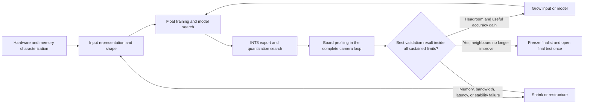

# Tracker rebuild plan

This is the single controlling plan for building Tracker. The active repository
contains the planning documents and the Stage 1 data-pipeline implementation;
later stages have not been scaffolded early.

The intended result is the highest-performing ESP32-P4 system that fits the
sustained hardware envelope, receives frames from
an OV5647 Raspberry-Pi-style MIPI-CSI camera, locates heads reliably across
ordinary, dark, noisy, crowded, distant, flat, and fisheye-like scenes, and
returns the position needed by a controller. Nothing is called fast, accurate,
or production-ready until it passes the physical-board gates in Stage 11.

## Non-negotiable rules

1. Complete one stage and its gate before beginning the next stage.
2. Keep head, face, visible body, full body, pose, and negative labels distinct.
3. Never infer that an image is negative merely because an annotation is absent.
4. Preserve source, version, checksum, annotation meaning, and split group for
   every image.
5. Geometric augmentation transforms image and vector labels together; targets
   are generated afterwards.
6. Fisheye augmentation keeps the complete canvas. It does not zoom or replace
   the scene with a crop.
7. Packed RAW10-derived Bayer input, ISP luminance, and ISP RGB are measured
   experiments. Deployment selects only after accuracy, memory-traffic, and
   board-latency measurements.
8. Quantization is ESP32-P4-specific INT8, not generic “INT8-compatible” export.
9. Start with clear portable code. Optimize only measured hot paths, and keep a
   tested reference implementation for every optimized kernel.
10. Debug, profile, and release behavior are compile-time profiles. Release hot
    paths do not carry runtime debug branches.
11. A host build, export, simulated INT8 run, or firmware build is not a board
    FPS or accuracy result.
12. A passed gate may be deliberately reopened by the named resource-feedback
    loop. Record why, which downstream artifacts become stale, and which tests
    must rerun.
13. Process one dataset at a time. Raw downloads and extraction trees are
    temporary staging only; promote a verified compact packet, delete that
    source's staging, prove it is gone, and only then start the next source.
14. Each responsibility is a clearly named importable module or standalone
    script with a public contract, tests, and CLI where useful. Dependencies
    flow in one direction; no stage reaches into another stage's private files.

## Fixed boundary and open decisions

Fixed now:

- Board: Waveshare `ESP32-P4-Module-DEV-KIT` with the 360 MHz
  `ESP32-P4NRW32`, 32 MB PSRAM, and 16 MB flash.
- Camera: OV5647 MIPI-CSI camera.
- Model path: PyTorch, static batch-one ONNX, ESP-PPQ quantization, and
  ESP32-P4 ESP-DL `.espdl` export.
- Deployment batch: one.
- Primary deployment target: head localization; face, body, mask, and pose data
  may provide auxiliary supervision but do not redefine a face box as a head.

Deliberately open:

- Packed-RAW10-derived Bayer, one-channel ISP luminance, or ISP RGB model input.
- Camera mode and model input dimensions.
- Output stride and final model topology.
- PTQ, AutoQuant-selected PTQ, TQT refinement, or QAT as the selected INT8
  result.
- Exact capture/model buffer count.
- Whether any custom assembly is justified.

## Entry gate

Before work starts, record a provisional product envelope: target scene types,
minimum required head size and maximum initial candidate input dimensions,
false-positive objective, hard model and memory ceilings, and latency/FPS
target. The initial dimensions define the 2× canonical packet storage profile;
they are reversible through source-by-source regeneration. Freeze the allowed float-to-INT8
degradation before quantization runs and the sustained-run limits before final
physical validation. A limit cannot be invented or relaxed after seeing the
evaluation it governs.

## Stage map

| Stage | Work | Required output | Gate |
|---:|---|---|---|
| 1 | Dataset acquisition | bounded per-source canonical packets, source/subsample manifests, native semantics, class-specific negatives, zero retained raw staging | every packet reconciles and raw cleanup is proved before the next source |
| 2 | Canonical corpus and targets | packet index, semantic-preserving labels, immutable source splits, leak-free internal splits, independent target package | conformance fixtures and sealed audit cases pass |
| 3 | Augmentation | full-canvas warp, physically ordered provisional low-light/noise model, exact label transforms | identity, no-crop, geometry, representability, and distribution tests pass |
| 4 | Parameterized PyTorch engine | one typed training system producing static Bayer-C1, luminance-C1, and RGB-C3 models | forward/backward, overfit, resume, and replay tests pass |
| 5 | Development setup and hardware characterization | reproducible ESP-IDF/VS Code setup, disposable benchmark app, measured camera/ISP/PPA/memory/model-input contracts | terminal and VS Code builds pass; candidate input contracts and resource envelopes are reproducible |
| 6 | Float input baselines | controlled Bayer/luminance/RGB results using hardware-exact candidate contracts | comparable validation reports and reproducible checkpoints exist |
| 7 | Resource-constrained model optimization | bidirectional input/model search, board feedback, multi-seed Pareto finalists | best useful model fits sustained memory, bandwidth, latency, and accuracy limits |
| 8 | Quantization pipeline | pinned P4 export, representative calibration, PTQ artifact, parity harness | valid `.espdl` and simulated INT8 evaluation pass |
| 9 | Quantization-oriented runs | separate PTQ, AutoQuant, TQT, and QAT comparisons | one validation-selected INT8 integration candidate and threshold are reproducible |
| 10 | Firmware integration | minimum-copy camera-to-centroid firmware with build profiles, telemetry, and board feedback | resource loop converges; complete stack is frozen; every copy and observable stage is accounted for |
| 11 | Physical and final validation | one final test evaluation plus sustained board evidence | every predeclared accuracy, memory, latency, FPS, and robustness limit passes |

## Controlled feedback loops

The stage order is the default dependency order, not a one-way waterfall. Three
explicit loops prevent an under-sized or over-sized result:

The characterization loop establishes initial input formats, exact shapes, and
resource estimates. The model loop brackets each seed with smaller and larger
neighbours. The integration loop replaces estimates with board measurements and
may reopen input shape/representation, topology, activation scheduling,
quantization, buffer placement/count, or firmware. Every loop uses validation
data; none may inspect the final test before the final freeze.

Canonical images are stored at up to twice the width and height of the maximum
current candidate input, without upsampling smaller originals. If feedback
later requires a larger model input than half the stored packet dimensions, the
affected packets are regenerated source-by-source from their manifests rather
than stretching insufficient images.

## Stage 1 — acquire the dataset

The implemented library is under [`Python/data_pipeline`](Python/README.md).
It currently provides strict configuration, the manifest and Open Images
adapters, bounded one-source staging, no-crop/no-upscale packet construction,
independent validation/reading, structured run reports, and verified raw cleanup.
Run `make data-check` before acquisition and `make data-plan` to inspect the
four-image real-source smoke profile without network or filesystem side effects.
This implements the acquisition machinery; the Stage 1 corpus gate remains open
until every portfolio source has a packet or a recorded access/partial-retrieval
result.

The project is authorized for personal, non-commercial research use of every
listed source, but it does not need every byte of an enormous source. Download
annotations/metadata first, choose a deterministic source-balanced and
stratified subset before pixel transfer whenever the source permits, and impose
a configured per-source image/byte ceiling. Large sources such as NightOwls
enter only through a useful bounded subsample; if partial retrieval is
impossible, do not download the multi-hundred-gigabyte archive merely to keep a
small fraction.

For each selected source, create a unique temporary staging directory, stream
or download only that source, verify and extract it, convert selected images and
vector labels into a self-describing compact packet, validate the packet, then
delete and verify removal of the raw/archive/extraction staging before moving to
the next source. The packet keeps images at roughly 2× the maximum current
target dimensions, preserves aspect ratio, and never upscales smaller sources.
Source identity, selection rules, and annotation semantics make it regenerable.

Negatives are class-specific evidence, never a generic empty-annotation claim.
Open Images negatives name the exact class MID and coverage status. NightOwls
may support `pedestrian_above_50px_verified_negative`, not `no_human`. Only a
complete manual check against the frozen human ontology may create
`no_human_verified`. Target-camera negatives are captured and certified during
the hardware-characterization stage, then admitted before float training.

Deliverables and the complete source portfolio are in [Data](docs/data.md).

## Stage 2 — canonical labels, splits, and targets

Convert native annotations into a provenance-preserving vector schema. Keep
`head_full`, `head_visible`, `head_point`, `face_visible`, `person_full`,
`person_visible`, native masks, and pose separate, with geometry quality
recorded as exact, approximate, derived, or weak. Face/body labels never create
head positives; a pose record may create only a declared weak head-centre target
when a sufficient visible-head-keypoint rule passes.

Preserve the publisher's split as immutable `source_split`; never promote its
validation/test images into training. Within publisher training data, group by
sequence, movie, camera, location, source URL, or duplicate cluster before any
internal split. Generate centre heatmaps, offsets, sizes, per-semantic validity
masks, and optional auxiliary targets only after final run geometry. A box can
create a box proxy, but never a claimed ground-truth segmentation mask.

The stage ends only after counts reconcile, cross-split duplicates are absent,
and empty/single/crowded/edge/occluded gold examples match both numerically and
visually.

## Stage 3 — build augmentation

Augmentation is a separately testable system. It contains:

- an exact identity/clean branch;
- flat images with photometric variation only;
- mild and medium full-canvas radial warps;
- a bounded strong fisheye-like branch;
- exposure loss, tone response, white balance, vignetting, shot noise, read noise,
  mild blur, and optional fixed-pattern noise.

There is no random resized crop and no telephoto zoom substitute. Head size may
balance small-object sampling or condition a declared nonphysical curriculum;
it does not become a false metric-depth or per-person lens model. Native
fisheye and target-camera images remain available as held-out evidence.

The exact warp and tests are in
[Targets and augmentation](docs/targets-and-augmentation.md).

## Stage 4 — build the parameterized training engine

Build one typed, validated PyTorch training system. It creates separate static
models for RAW-derived Bayer C1, ISP-luminance C1, and ISP-RGB C3 inputs; there
is no runtime input-mode branch in the deployed graph. A resolved run
configuration records dataset and split hashes, input conversion, target
definition, architecture, optimizer, schedule, augmentation, seed, checkpoints,
evaluation cadence, and future quantization target.

Before real training, require a one-batch forward/backward check, a tiny-subset
overfit, deterministic augmentation replay, checkpoint/resume equivalence, and
CPU/accelerator agreement within tolerance.

See [Training](docs/training.md).

Implementation follows the one-way module structure in
[Code organization](docs/code-organization.md). Acquisition, source adapters,
packet building, targets, augmentation, training, export, quantization, and
evaluation can each be read, invoked, and tested independently.

## Stage 5 — set up and characterize the hardware

First create a reproducible development environment: verify the VS Code
Espressif extension, install a pinned stable ESP-IDF plus the ESP32-P4 compiler,
debugger, OpenOCD, Python environment, CMake, and Ninja through the terminal,
create a minimal ESP-IDF application, set `esp32p4` as its target, and prove
terminal and VS Code build/flash/monitor/debug flows. Store a machine-readable
doctor report and exact tool versions.

Then use a disposable benchmark application—not production firmware—to record
the fixed board/camera details and silicon revision; enumerate OV5647 modes;
capture representative RAW and ISP frames plus certified empty-scene negatives;
and compare three input families:

1. packed RAW10 Bayer capture followed by the least expensive correct
   unpack/downsample/INT8 mapping available;
2. ISP YUV/luminance followed by PPA full-frame scaling and a C1 model;
3. ISP RGB followed by PPA full-frame scaling/colour conversion and a C3 model.

Benchmark internal SRAM and PSRAM read/write/copy bandwidth by working-set size,
alignment, cache size, core, and DMA/CPU path; camera-only capture; ISP; PPA;
model-only inference; and combined camera→preprocess→model operation. Sweep
buffer count and placement. Emit CSV/JSON containing config hashes, bytes moved
per frame, p50/p95 latency, throughput, drops, corruption, heap/activation peaks,
and the evidence type for every bandwidth value.

This stage freezes reproducible candidate input contracts and a provisional
resource envelope for training, fits augmentation ranges from captured frames,
and admits target-camera negatives. It does not implement the final stack. See
[Hardware characterization](docs/hardware-characterization.md).

## Stage 6 — run controlled float input baselines

The Bayer/luminance/RGB comparison begins from the same source sample, sampler
order, split, seed, geometric transform, exposure, and photon/read-noise
realization. It forks only at a declared sensor/input simulation matching the
measured hardware path. The post-input architecture, targets, optimizer, and
schedule remain the same; first-layer differences are reported explicitly.

Compare validation AP/precision-recall, distant-head recall, candidate-specific
thresholds chosen under one certified-negative false-positive policy, stress
strata, model work, activation memory, and predicted board input cost. Then run
a second resource-matched comparison under the same measured latency and peak
memory envelope. The final test remains sealed.

## Stage 7 — optimize with board feedback

Search in both directions from several bracketed seeds: smaller and larger input
resolution, output stride, width, depth, block type, feature-map width, and
activation lifetime. The objective is the highest validated task performance
inside the sustained board envelope—not the largest file in isolation. Grow a
candidate while memory, bandwidth, latency, and stability remain inside their
limits and accuracy still improves; shrink or restructure it when any limit
fails. A model that leaves useful resources idle is treated as under-sized, and
a model that only starts but cannot sustain the full camera loop is over-sized.

Each float or INT8 board measurement updates the resource model. If estimated
and measured activation peaks, PSRAM traffic, cache behavior, or latency differ,
return to the earliest affected decision: input representation/shape, model
topology, training, quantization, buffer schedule, or firmware placement. Reuse
validation data for this loop and keep the final test sealed. Freeze a small
multi-seed Pareto set only when no neighbouring candidate provides a useful
accuracy gain within the complete resource envelope.

## Stage 8 — build the P4 quantization pipeline

Pin current compatible ESP-DL and ESP-PPQ versions, confirm operator support,
export static batch-one ONNX, and prove PyTorch/ONNX parity. Freeze exact
camera-byte preprocessing from the completed hardware input contract. Build a
deterministic training-only calibration manifest sampled in deployment-
representative proportions. Keep a separate adversarial quantization pack for
rare, dark, noisy, warped, crowded, distant, edge, and negative cases.

The first required result is a plain P4 INT8 PTQ baseline using symmetric
power-of-two quantization, current P4 per-channel Conv/Gemm rules, per-tensor
rules elsewhere, and round-half-even behavior. Export `.espdl`, `.info`, `.json`,
hashes, metadata, and several explicit golden inputs.

See [Quantization](docs/quantization.md).

## Stage 9 — run quantization-oriented experiments

Compare separate candidates:

1. fixed default all-INT8 PTQ;
2. AutoQuant-selected all-INT8 PTQ, with evaluation on quantization-validation
   data rather than calibration or final-test data;
3. PTQ initialized with TQT threshold/weight refinement;
4. QAT warm-started from the reproducible frozen float checkpoint;
5. explicitly named combinations only when standalone results justify them.

Do not stack methods without an ablation and do not select by layer SNR or file
size alone. Inspect export dispatch and reject unintended INT16/float fallbacks.
Choose each candidate's operating threshold on validation under the same policy,
report threshold-free curves plus a common-threshold diagnostic, then freeze the
model, recipe, preprocessing, and threshold as the reproducible integration
candidate. Do not open the final test yet: firmware/resource measurements may
still reopen an upstream choice.

## Stage 10 — integrate minimum-copy firmware

Use the camera and preprocessing contract already proved by the bounded
characterization harness. Implement the selected Bayer, luminance, or RGB path
with a per-frame byte-movement ledger. The leading luminance candidate is OV5647
RAW10 → ISP YUV420 → PPA full-frame scale → small GRAY8 → exact INT8 mapping;
the direct-Bayer and RGB candidates remain eligible if their measured
accuracy/resource results are better.

PPA scaling is hardware-accelerated but not in-place, so it writes a separate
small output buffer. Avoid every other full-frame copy; prefer DMA ownership
transfer, bounded queues, buffer reuse, and overlap only where measurement shows
net benefit. ISP ROI cropping is
optional and disabled initially. The initial PPA source block is the complete
negotiated frame; block selection may become a separate compile-time geometry
choice only after its field-of-view effect is measured. Camera mode, input
shape, channel count, buffer count, and diagnostics are compile-time profiles.

Start in portable C/C++ and use ESP-DL's optimized operators. Tiny measured leaf
sequences may use guarded inline assembly; substantial loops or reusable kernels
belong in separate `.S` files. Every optimized path retains a reference-C
differential test.

When the complete loop meets all limits and neither a larger nor restructured
validation candidate improves usefully inside the envelope, freeze the input
contract, model, quantization recipe, threshold, firmware, build profile,
buffer schedule, and memory placement together. Only this complete freeze may
advance to the final test.

See [Deployment](docs/deployment.md).

## Stage 11 — physical and final validation

Validate the selected full chain on the board: sensor → CSI → ISP/bypass →
optional PPA/Bayer reduction → input mapping → ESP-DL → decoder. Measure camera
modes, frame corruption, dropped frames, CSI+ISP frame-completion latency and
throughput, p50/p95 observable-stage and end-to-end latency, PSRAM traffic with
evidence type, peak heaps, largest
free block, model memory, output parity, false positives, localization error,
and sustained camera-to-centroid FPS. Isolated ISP latency is reported only from
a documented standalone DMA harness and never presented as a decomposition of
the live streaming path.

The acceptance matrix is in [Validation](docs/validation.md). Until it passes,
20–25 fps remains a target rather than a result.

After the complete-stack freeze, evaluate the matched float parent and selected
INT8 model on the sealed final test together exactly once, then run the final
physical acceptance/soak protocol without retuning.

## Document map

- [Data](docs/data.md): bounded research portfolio, one-source staging, compact packets, semantics, negatives, and acquisition gates.
- [Code organization](docs/code-organization.md): readable modules, dependency direction, CLIs, and artifact contracts.
- [Targets and augmentation](docs/targets-and-augmentation.md): heatmaps, masks, radial warp, noise, and property tests.
- [Hardware characterization](docs/hardware-characterization.md): terminal/VS Code setup, benchmarks, RAW10 investigation, and resource envelope.
- [Training](docs/training.md): configuration, Bayer/luminance/RGB experiments, loop, and optimization runs.
- [Quantization](docs/quantization.md): P4 INT8 semantics, PTQ/TQT/QAT ladder, artifacts, and parity.
- [Deployment](docs/deployment.md): OV5647/ISP/PPA path, buffers, compile profiles, and assembly policy.
- [Validation](docs/validation.md): adversarial audit and stage acceptance matrix.
- [Sources](docs/sources.md): current primary sources and verification boundary.
