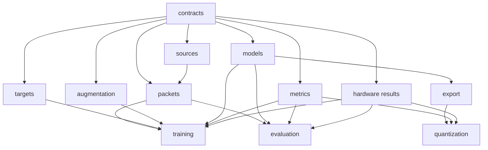

# Code organization and stage packets

## Design rule

The implementation is a set of small importable packages and thin scripts, not
one training program with every responsibility mixed together. Each package can
be read, installed, tested, and invoked independently. A package may import only
declared lower-level packages; it may not open another stage's private files or
depend on its CLI implementation.

There are two distinct meanings of “packet”:

- a **code package** is a small Python library with a public API and tests;
- an **artifact packet** is an immutable self-describing output directory that
  another package can validate and consume.

## Planned Python workspace

```text
python/
  pyproject.toml                 # workspace tooling and one locked environment
  packages/
    tracker_contracts/           # schemas, typed IDs, geometry, manifests
    tracker_sources/             # adapter protocol and one module per source
    tracker_packets/             # bounded staging and canonical packet builder
    tracker_targets/             # heatmaps, offsets, sizes, validity masks
    tracker_augmentation/        # geometry, sensor/input simulation, replay
    tracker_models/              # static model definitions and cost metadata
    tracker_metrics/             # threshold-free and operating-point metrics
    tracker_training/            # loop, sampler, checkpoints, run orchestration
    tracker_export/              # PyTorch-to-ONNX parity and export records
    tracker_quantization/        # ESP-PPQ PTQ/AutoQuant/TQT/QAT orchestration
    tracker_evaluation/          # validation/final reports and strata
    tracker_hardware_results/    # benchmark schema, parser, resource predictor
```

Every directory has its own `pyproject.toml`, `README.md`, `src/<package>/`,
`tests/`, and tiny synthetic or explicitly versioned fixtures. The workspace
lock gives reproducible integration, while each package's metadata permits an
independent editable install and test. Dataset adapters are separate modules
behind one protocol; adding or fixing one source does not edit a giant chain of
source-specific `if` statements.

## Dependency direction



Arrows mean “is allowed to be imported by.” Cycles are forbidden. Hardware
result parsers expose measured resource contracts; Python training code does not
import firmware, invoke VS Code, or parse ad-hoc serial text directly.

## Package contract

Every code package provides:

1. a one-paragraph responsibility and explicit non-responsibilities;
2. a small typed public API exported from one place;
3. a thin `python -m <package>` CLI that calls the same API used by tests;
4. a fully resolved configuration schema with unknown-field rejection;
5. unit tests, adversarial cases, and minimal fixtures;
6. an independent `check` command that does not require later stages;
7. structured errors and machine-readable reports rather than log parsing;
8. no hidden network access, filesystem traversal, global mutable registry, or
   import-time work.

Shared utilities enter `tracker_contracts` only when they are genuinely stable
cross-stage contracts. Convenience functions remain with their owner; there is
no miscellaneous `utils.py` dumping ground.

## Artifact packet contract

Every durable stage output follows the same readable envelope:

```text
<artifact>/
  README.md
  manifest.json
  payload/
  reports/validation.json
  checksums.sha256
```

The manifest records schema version, producer package/version and code commit,
resolved configuration, parent artifact hashes, created files, counts, and
status. The README explains what the artifact is, how to inspect it, how to run
its independent validator, and what it does not prove. Payload formats remain
stage-specific but are declared, versioned, and accessible through a public
reader API.

An artifact becomes consumable only after its validator passes and it is
atomically promoted from a temporary output directory. Consumers check schema,
hashes, and parent identities before use. Outputs are immutable; reruns create a
new artifact ID rather than changing reviewed bytes.

## Stage outputs

| Producer | Durable packet | Explicitly absent |
|---|---|---|
| source adapter + packet builder | compact per-source image/vector packet | raw archive, extraction tree, heatmaps |
| corpus indexer | packet list, split/group/duplicate index | copied pixels |
| target package | numeric/rendered conformance packet | full dataset-sized raster cache |
| augmentation package | replay manifest, property report, bounded previews | augmented dataset copy |
| training package | config, logs, metrics, checkpoints, parent hashes | hidden defaults or copied corpus |
| export package | ONNX, parity tensors/report, operator inventory | quantization claims |
| quantization package | `.espdl` family, metadata, calibration manifest, parity report | raw calibration images or final-test access |
| hardware runner/parser | benchmark JSON/CSV, config/build hashes, resource model | unstructured-only serial evidence |
| evaluation package | immutable metric report and operating threshold record | model mutation or threshold tuning on final test |

## Data loading boundary

Training reads compact source packets through the `tracker_packets` public
reader. Targets and augmentation are generated in memory. If profiling proves a
cache is required, the cache is content-addressed by packet, configuration, and
producer version; it has a hard size limit, is safe to delete, and is never the
only copy of a durable artifact.

The data downloader imports contracts, adapter interfaces, and packet-building
APIs. It cannot import training, models, targets, or augmentation. This keeps the
destructive raw-staging cleanup small enough to audit independently.

## Firmware and terminal scripts

The same ownership rule applies outside Python:

```text
firmware/
  characterize/                  # disposable benchmark application
  tracker/                       # final application and compile-time profiles
  components/
    tracker_camera/              # OV5647/CSI/ISP ownership
    tracker_preprocess/          # PPA/Bayer/INT8 mapping
    tracker_model/               # ESP-DL loading and invocation
    tracker_decode/              # tensor-to-centroid reference/optimized paths
    tracker_telemetry/           # timing, memory, traffic, drop/corruption data
tools/
  idf/                           # setup, doctor, build/flash/monitor runners
  data/                          # one-source acquisition and packet validation
  experiments/                   # training/export/quant/board matrix runners
```

Each firmware component owns a public header, source directory, CMake metadata,
README, and unit/differential tests. Applications compose components; components
do not import application internals. Shell scripts are short environment/CLI
entrypoints. Non-trivial parsing, selection, validation, or state transitions
live in the corresponding tested Python package rather than accumulating in a
large shell script.

## Review gate

- Each package can be installed and tested alone from its directory.
- A dependency-graph check rejects undeclared imports and cycles.
- Every CLI calls the public library API and has `--help`, `--check`, and a dry
  run where it performs downloads, deletion, flashing, or other side effects.
- Every artifact validates without importing its producer's private modules.
- No stage creates a permanent duplicate of pixels or model-sized targets.
- Cross-stage integration tests use only public APIs and artifact packets.
