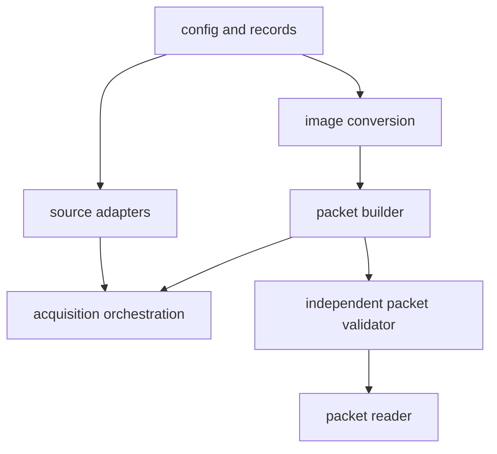

# Code organization and stage packets

## Design rule

The code should be obvious from the directory names. Python responsibilities
are separate modules inside one project, not a collection of nested projects
whose package, source, and distribution names repeat one another.

There are two distinct meanings to keep clear:

- `Python/data_pipeline/` is the importable code library;
- a **data packet** is an immutable directory produced by that library.

## Python layout

```text
Python/
  README.md                       # first place to understand the Python code
  pyproject.toml                  # one environment and one lock
  data_pipeline/                  # the single importable library
    __main__.py                   # thin command-line entry point
    config.py                     # strict resolved configuration
    records.py                    # canonical vector/provenance schemas
    acquire.py                    # one-source staging and cleanup lifecycle
    transfer.py                   # bounded metadata and selected-image transfer
    images.py                     # orientation, resize, encoding, label transform
    sources/                      # external dataset adapters only
      manifest.py                 # strict predeclared source manifest
      open_images.py              # Open Images metadata and selection
    packets/                      # durable output responsibilities only
      build.py                    # create an unpromoted packet
      validate.py                 # independent packet validator
      read.py                     # public training/evaluation reader
  tests/                          # unit, adversarial, and integration tests
configs/data/                     # reviewed run configurations
tools/data/                       # only thin terminal helpers if needed
```

The names answer the navigation questions directly: external dataset logic is
under `sources`; durable artifact logic is under `packets`; all other files name
the operation they own. There is no generic `utils.py`, repeated `tracker_`
prefix, `packages/` layer, or nested `src/<same-name>` layer.

## Dependency direction



The command line calls these public library APIs. Tests call the same APIs.
Sources never import packets or training. The data pipeline never imports
targets, augmentation, models, or firmware.

## Code contract

The project provides:

1. strict configuration with unknown-field rejection;
2. typed public records exported from named modules;
3. `python -m data_pipeline` commands for check, dry-run, acquire, validate,
   and inspect;
4. unit, adversarial, and real-path smoke tests;
5. structured JSON errors and reports rather than log parsing;
6. no network access or filesystem writes at import time;
7. no hidden raw-retention or overwrite switch.

Dataset-specific adapters remain separate files so one parser can change without
creating a large source-specific conditional chain. If the library eventually
becomes too large, a measured ownership problem—not a preference for packaging
machinery—must justify splitting it.

## Data packet contract

Every promoted source packet is directly readable:

```text
<packet>/
  README.md
  packet.json
  selection.json
  records.jsonl
  images/
  reports/validation.json
  checksums.sha256
```

`packet.json` records schema, producer revision, resolved logical configuration,
source metadata checksums, storage profile, counts, and exact file inventory.
`selection.json` freezes the deterministic selection. `records.jsonl` contains
canonical vector labels and provenance. The validator checks the schema, exact
file/checksum inventory, image decode and dimensions, no-upscale envelope,
geometry bounds, record counts, and absence of raw archives or raster target
caches.

A packet is built in a non-consumable temporary output directory. Only after it
validates and the source staging directory is proved deleted is it atomically
renamed to its immutable packet ID. Exact reruns validate or refuse the existing
destination; changed source, selection, storage, or limits create a new ID.

## Later responsibilities

Targets, augmentation, training, export, quantization, evaluation, and hardware
results will each receive a similarly direct named module or top-level library
only when their stage begins. They should not be scaffolded early. Training will
read pixels and vector records only through `data_pipeline.packets.read` and
will generate targets in memory.

Firmware retains responsibility-based components:

```text
firmware/
  characterize/
  tracker/
  components/
    camera/
    preprocess/
    model/
    decode/
    telemetry/
tools/
  idf/
  data/
  experiments/
```

## Review gate

- A new reader can identify every Python responsibility from `Python/README.md`
  and the immediate `data_pipeline/` filenames.
- `uv sync --project Python` creates the only Python environment.
- `make data-check` runs formatting, lint, tests, library check, and a no-side-
  effect dry run.
- Every CLI uses the same public API as tests.
- The independent packet validator does not depend on acquisition internals.
- No packet contains raw archives, extraction trees, heatmaps, augmented copies,
  or model-sized target caches.
